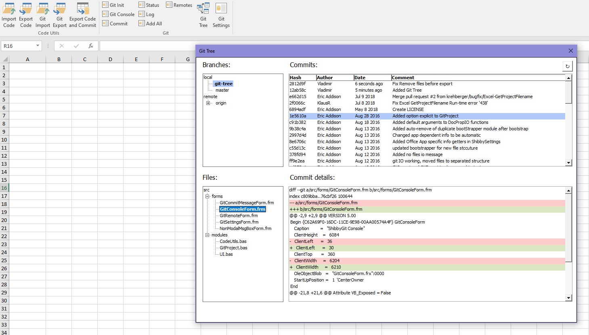
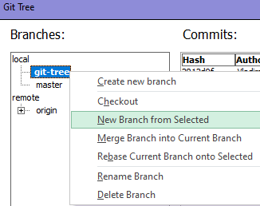
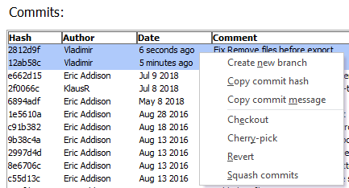
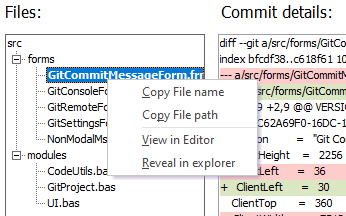

# ShibbyGit

Git integration for VBA.

This is a VBA project to add some Git integration into the MS Office VBA editor.
This has been done before, but I wanted to give it a try myself.

Currently works fine as a front end for `git.exe`.

## Overview

Fork of project <a href="https://github.com/ericaddison/ShibbyGit">ShibbyGit</a> by <a href="https://github.com/ericaddison">Eric Addison</a> with some changes.
 
Added GitTree userform, which allow to view changes between commits for every file.
 
Listboxes realised with using <a href="https://github.com/balin77/ExcelDesignListBox">DesignListBox</a> by <a href="https://github.com/balin77">balin77</a>.
 
Tested on Microsoft Excel only but should work with Word and PowerPoint.

## How to use

1. Install git (Link: <a href="https://git-scm.com/download/win">https://git-scm.com/download/win</a> )
2. Enable trust access to the VBA project object model
      1. Start Microsoft Excel.
      2. Open a workbook.
      3. Click File and then Options.
      4. In the navigation pane, select Trust Center.
      5. Click Trust Center Settings....
      6. In the navigation pane, select Macro Settings.
      7. Ensure that Trust access to the VBA project object model is checked.
      8. Click OK.
3. Download excel example file from <a href="https://github.com/dmitrievva/ShibbyGit/releases">Releases</a>, save as .xlam add-in and open in Excel.
4. Setup Git settings by pressed `Git Settings` button on task pane.
5. Initialize git repository by pressed `Git Init` button on task pane.

## Features

-   Branches Tree View with context menu (on right mouse click)
      Supported features:
    -   Create new branch
    -   Checkout branch
    -   New branch from selected
    -   Merge selected branch into current branch
    -   Rebase current branch onto selected branch
    -   Rename branch
    -   Delete branch

-   Commits ListBox with context menu and multiselect (with holded `ctrl` button)
      Supported features:
    -   Copy commit hash
    -   Copy commit message
    -   Checkout selected commit
    -   Cherry-pick selected commit
    -   Revert selected commit
    -   Squash selected commits (using `git reabse -i`)

-   File Tree View with context menu (on right mouse click)
      Supported features:
    -   Copy file name
    -   Copy file path
    -   View selected file in editor VBE
    -   Reveal folder of selected file in explorer

